<div align="center">


# StockSense

**Real-time inventory and warehouse management for teams that move physical stock.**

Receipts, deliveries, transfers and stock counts on one transactional ledger, with live updates,
barcode scanning, stockout forecasting and one-click replenishment.


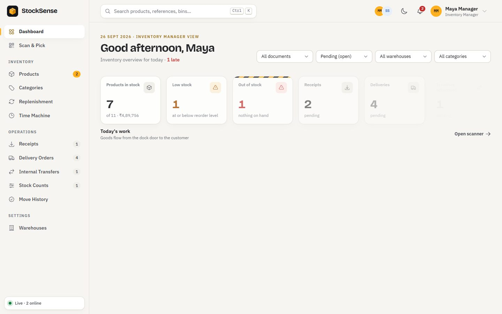

</div>

---

## Contents

- [Why StockSense](#why-stocksense)
- [Features](#features)
- [Screenshots](#screenshots)
- [Tech stack](#tech-stack)
- [Getting started](#getting-started)
- [Roles and permissions](#roles-and-permissions)
- [How stock moves](#how-stock-moves)
- [Keyboard shortcuts](#keyboard-shortcuts)
- [Project structure](#project-structure)
- [API reference](#api-reference)
- [Testing](#testing)

---

## Why StockSense

Spreadsheets and paper pick lists drift out of sync with the shelves: stock runs out without warning,
the same order is picked twice, and nobody knows who changed what. StockSense replaces them with a
single ledger that every screen reads from, live, for everyone on the team.

- **One source of truth.** Every stock change is a move in the ledger, written inside a MongoDB
  transaction. On-hand, history and forecasts are all derived from it.
- **Built for the floor.** Scan with a USB gun, a phone camera or the keyboard. Wrong item or wrong
  bin is refused on the spot.
- **Ahead of problems.** Usage and lead times turn into an "order by" date, and replenishment drafts
  the purchase receipts for you.

## Features

### Inventory operations
- **Receipts, delivery orders, internal transfers and stock counts** with a clear lifecycle:
  draft, waiting, ready, done or canceled.
- **Pick, then pack, then ship** for deliveries, with availability checked at the source location.
- **Stock counts** with reasons (count, damaged, lost, found, expired), optional blind counts, and
  manager approval before any correction is booked.
- **Products and categories** with SKUs, units of measure, reorder rules, unit cost, preferred
  supplier and lead time. Archive instead of delete, so history stays intact.
- **Multiple warehouses** with racks, bins and zones, shown as a live isometric floor plan.

### Real time
- **Live Warehouse:** dashboards, lists, badges and the activity feed update the moment anyone
  confirms, picks, packs, scans or validates (Server-Sent Events).
- **Presence:** see who else has the same operation open.
- **Stock alerts** for low and out-of-stock products, in the app and by email to managers.

### Scan & Pick
- Printable **Code 128 labels** for products, bins and documents.
- Scan against any open operation: the right line counts up, over-picking is blocked, and a fully
  scanned delivery marks itself picked. Sound, vibration and a laser sweep confirm every scan.
- `/scan` opens whatever you scan: a product, a bin or a document.

### Insights
- **Time Machine:** exact stock per product and location at the end of any past day, rebuilt from the
  ledger. Drag the scrubber or press *Replay history*.
- **Stockout forecast:** average daily usage, days of cover, projected stockout date and "order by"
  date, on a 60-day history plus 30-day projection chart.
- **One-click replenishment:** everything heading for a stockout, grouped by supplier with suggested
  quantities, turned into receipts in one go. Stock already on its way is counted.
- **Move History** with running balances, a timeline view and CSV export.

### Experience
- Light and dark themes, a **command palette** (<kbd>Ctrl</kbd> <kbd>K</kbd>) and keyboard shortcuts.
- **Action scenes:** a truck unloads at the dock, a carton is picked and taped, the delivery truck
  drives off, a forklift moves a pallet, all in under two seconds and skippable with a click.
- A landing page with a **3D warehouse** that plays out receive, store, pick and ship as you scroll.
- Works on phones (bottom navigation with a large Scan button), respects *reduced motion*, and needs
  no CDN: every library and font is served locally.

## Screenshots

| | |
|---|---|
| 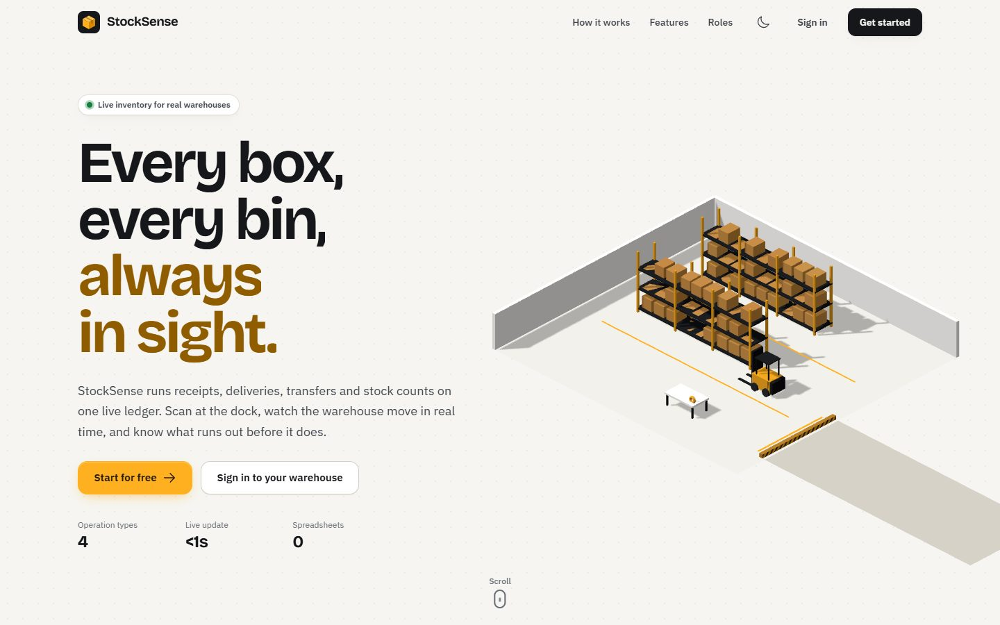 **Landing page** with a scroll-driven 3D warehouse | 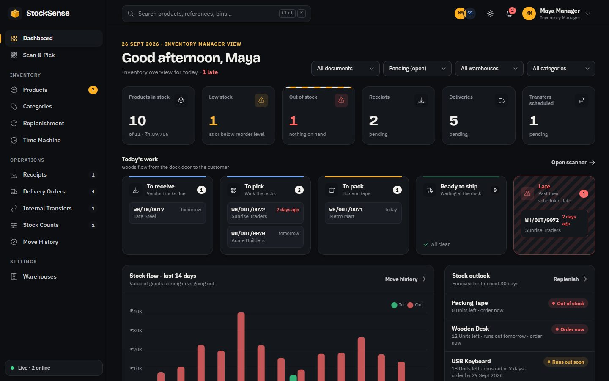 **Dashboard** in the dark theme |
| 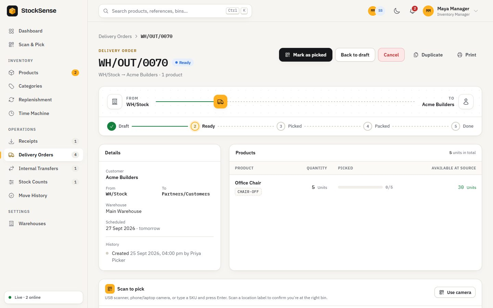 **Delivery order** with its route, steps and scan panel | 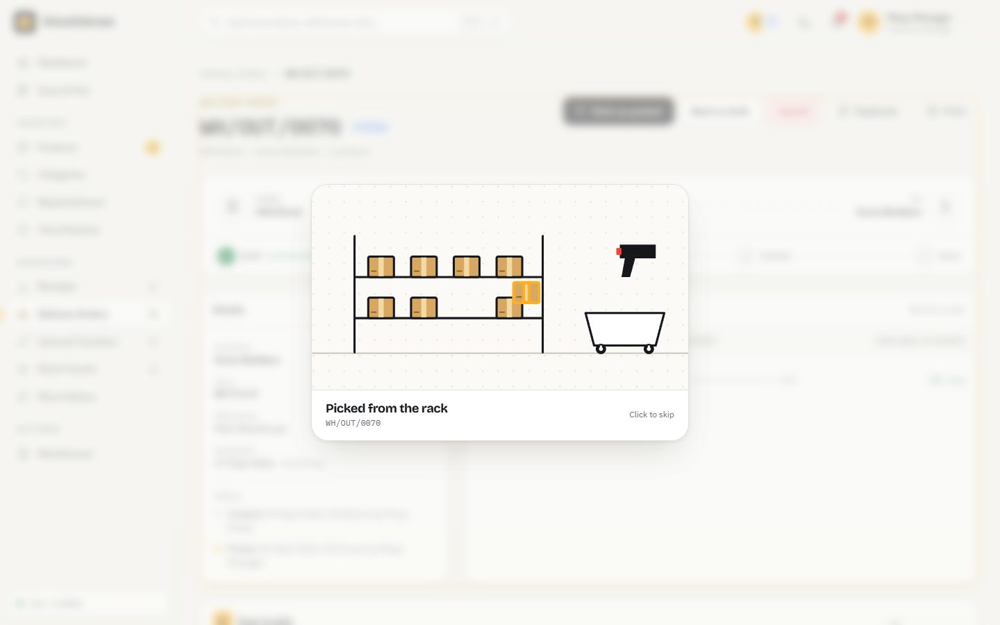 **Action scene** after marking an order picked |
| 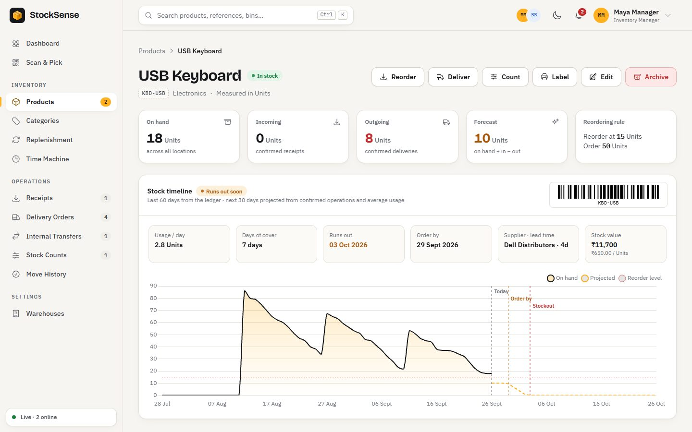 **Product** with stock timeline and stockout forecast | 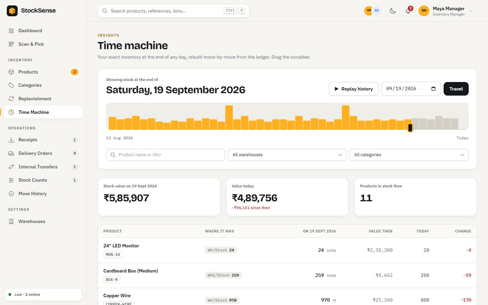 **Time Machine** with the activity scrubber |
| 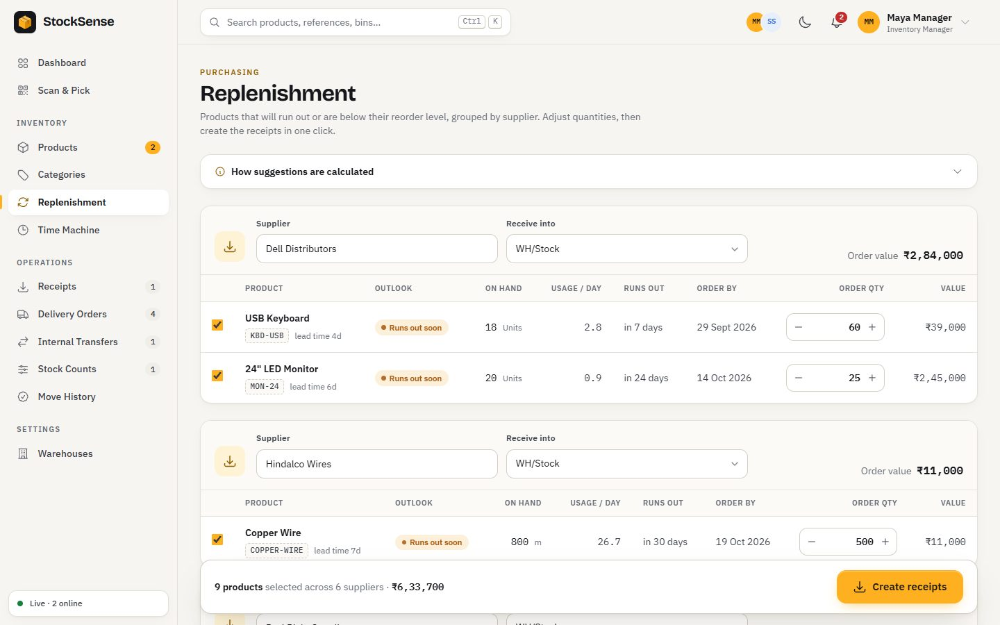 **Replenishment** grouped by supplier | 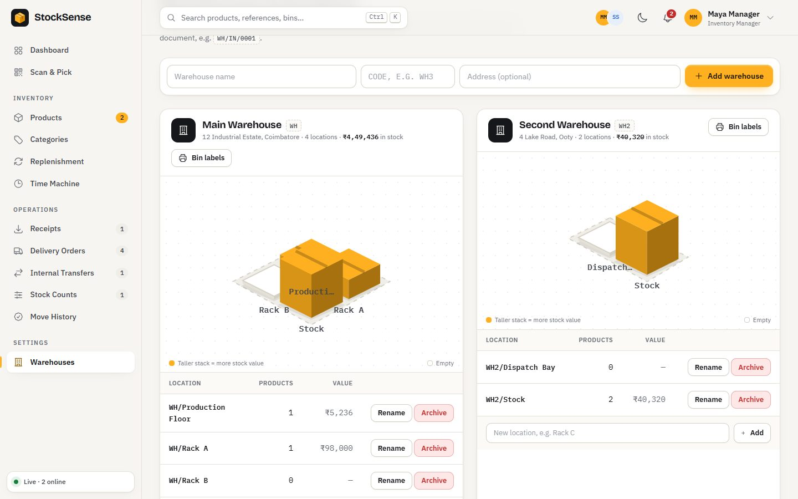 **Warehouses** as isometric floor plans |
| 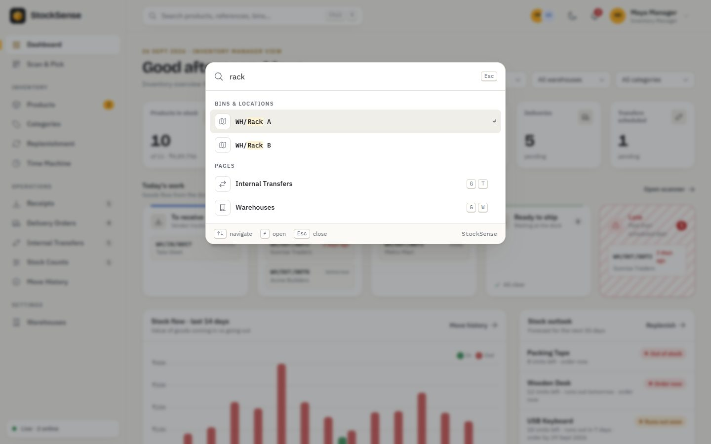 **Command palette** across products, documents and bins | 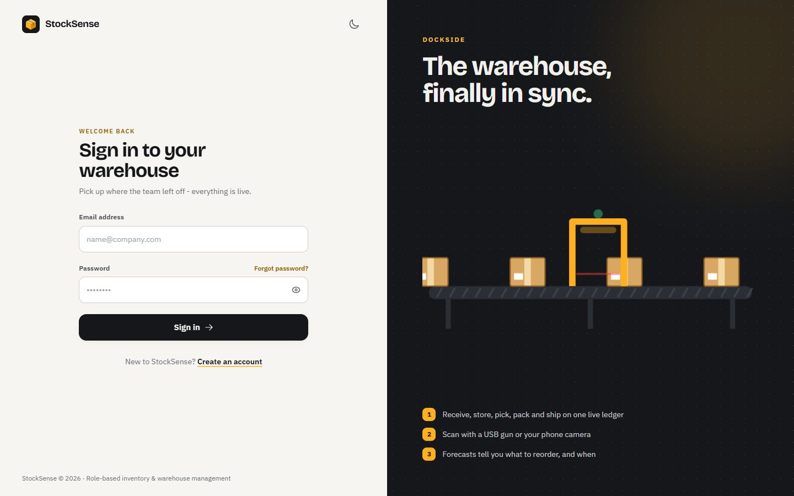 **Sign in** |

<p align="center">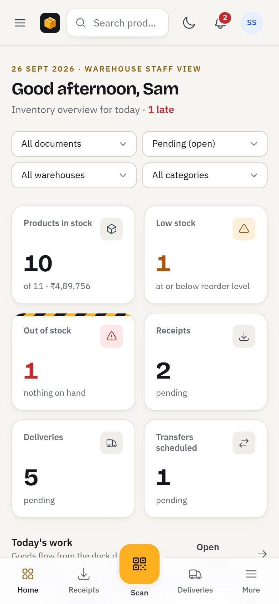<br><em>On a phone</em></p>

## Tech stack

| Layer | Technology |
|---|---|
| Server | Node.js, Express 5, EJS server-rendered pages, JSON API |
| Database | MongoDB with Mongoose 9; multi-document transactions for every stock change |
| Auth | JWT in an HTTP-only cookie (or Bearer token), bcrypt, email OTP for sign-up and password reset (Nodemailer) |
| Real time | Server-Sent Events with presence and online status |
| UI | Tailwind CSS 4 design system, GSAP animations, Three.js landing scene, Lenis smooth scroll |
| Charts and codes | Chart.js, JsBarcode (Code 128), html5-qrcode (camera scanning) |
| Tests | Node's built-in test runner, mongodb-memory-server |

## Getting started

### Prerequisites
- **Node.js 20 or newer**
- MongoDB is optional: `npm run db` starts a local replica set for you (transactions need one).

### 1. Clone and install

```bash
git clone https://github.com/SHIVA-hub577/StockSense-Inventory-Management-.git
cd StockSense-Inventory-Management-
npm install
```

### 2. Configure

```bash
cp .env.example .env
```

| Variable | Purpose |
|---|---|
| `PORT` | HTTP port (default `5000`) |
| `MONGO_DB_URL` | MongoDB connection string. For the local database use `mongodb://127.0.0.1:27017/stocksense?replicaSet=rs0` |
| `JWT_SECRET` | Any long random string |
| `GOOGLEUSER`, `GMAIL_APP_PASSWORD` | Gmail sender for OTP and alert emails. Leave empty in development and codes are printed in the server console instead |

Never commit your `.env` file.

### 3. Start the database and load demo data

```bash
npm run db      # local MongoDB replica set, keep this terminal open (data in .localdb/)
npm run seed    # demo warehouses, products, operations and users
```

The seed prints the demo logins when it finishes:

| Role | Email |
|---|---|
| Inventory Manager | `manager@stocksense.test` |
| Warehouse Staff | `staff@stocksense.test` |
| Warehouse Staff | `priya@stocksense.test` |

### 4. Run

```bash
npm run dev     # auto-reload with nodemon
# or
npm start
```

Open **http://localhost:5000**. Try two browsers signed in as different users to watch the live updates.

### Scripts

| Command | What it does |
|---|---|
| `npm run dev` / `npm start` | Start the server (with / without auto-reload) |
| `npm run db` | Start a local MongoDB replica set |
| `npm run seed` | Reset inventory data and load the demo |
| `npm test` | Run the test suite (uses its own in-memory database) |
| `npm run css` / `npm run css:watch` | Build the stylesheet from `styles/app.css` into `public/css/app.css` |

> The compiled stylesheet is committed, so you only need `npm run css` after changing styles or templates.

## Roles and permissions

One sign-up and one login for everyone. The role decides what you can do, checked on every route.

| | Inventory Manager | Warehouse Staff |
|---|:---:|:---:|
| View stock, forecasts, history, dashboards | ✓ | ✓ |
| Receive, pick, pack, ship, transfer | ✓ | ✓ |
| Count stock | ✓ | ✓ |
| Apply stock counts (book differences) | ✓ | |
| Create and edit products, categories, reorder rules | ✓ | |
| Manage warehouses and locations | ✓ | |

## How stock moves

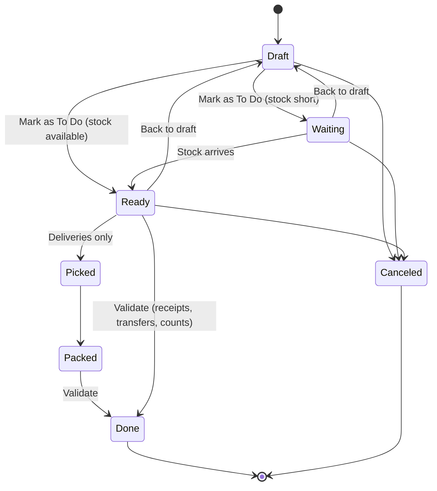

Validating an operation writes one ledger move per line and updates stock per location inside a
single MongoDB transaction: either every change is saved or none is. Documents are numbered per
warehouse, for example `WH/IN/0042`, `WH/OUT/0107`, `WH/INT/0009`.

**Forecast model.** For each product and each future day *d*:

```
projected(d) = on hand + confirmed receipts (≤ d) − max(confirmed deliveries (≤ d), average daily usage × d)
```

The stockout date is the first day the projection reaches zero; the order-by date is that day minus
the supplier's lead time.

## Keyboard shortcuts

| Keys | Action |
|---|---|
| <kbd>Ctrl</kbd> <kbd>K</kbd> or <kbd>/</kbd> | Search products, documents and bins, or run a command |
| <kbd>?</kbd> | Show all shortcuts |
| <kbd>G</kbd> then <kbd>D</kbd> / <kbd>P</kbd> / <kbd>R</kbd> / <kbd>O</kbd> / <kbd>T</kbd> / <kbd>C</kbd> / <kbd>M</kbd> | Dashboard, Products, Receipts, Deliveries, Transfers, Counts, Move History |
| <kbd>Enter</kbd> / <kbd>Shift</kbd> <kbd>Enter</kbd> | Next / previous row on a count sheet |

## Project structure

```
├── app.js                 Express app (routes, static files, vendor assets)
├── server.js              Starts the server and connects to MongoDB
├── config/                Database connection
├── models/                Mongoose models: Product, Operation, StockMove, StockQuant, Location, ...
├── services/              Business logic: stock engine, insights, live hub, alerts, scanning, search
├── controllers/           Page and API handlers
├── routes/                Page routes, auth routes, JSON API
├── middleware/            Auth, role checks, page locals, errors
├── utils/                 View helpers, email, request parsing
├── views/                 EJS pages, layouts and partials
├── public/
│   ├── css/app.css        Compiled stylesheet
│   └── js/                Browser scripts (live updates, palette, scenes, 3D landing, forms)
├── styles/app.css         Design system source (Tailwind CSS 4)
├── scripts/               Local database and demo seed
└── test/                  Stock engine, API and feature tests
```

## API reference

Every page is backed by a JSON API. Responses look like `{ success, message, data }`. Authenticate with
the session cookie or `Authorization: Bearer <token>`.

<details>
<summary><strong>Authentication</strong> (<code>/auth</code>)</summary>

| Method | Endpoint | Body | Description |
|---|---|---|---|
| `POST` | `/auth/send-signup-otp` | `email` | Email a 6-digit sign-up code |
| `POST` | `/auth/signup` | `name`, `email`, `password`, `role`, `phone?`, `otp` | Verify the code and create the account |
| `POST` | `/auth/login` | `email`, `password` | Sign in (sets the session cookie) |
| `ALL` | `/auth/logout` | | Sign out |
| `POST` | `/auth/forgot-password` | `email` | Email a reset code |
| `POST` | `/auth/verify-otp` | `email`, `otp` | Check a reset code |
| `POST` | `/auth/reset-password` | `email`, `otp`, `newPassword` | Set a new password |
| `GET` | `/auth/me` | | Current user |

</details>

<details>
<summary><strong>Products and categories</strong></summary>

| Method | Endpoint | Access | Description |
|---|---|---|---|
| `GET` | `/api/products` | Any | List; filters `search`, `category`, `status` (`ok`, `low`, `out`, `attention`), `archived`, `page` |
| `GET` | `/api/products/:id` | Any | Product with on hand, incoming, outgoing, forecast, stock per location |
| `POST` | `/api/products` | Manager | Create (optionally with initial stock) |
| `PATCH` | `/api/products/:id` | Manager | Update |
| `POST` | `/api/products/:id/archive` · `/restore` | Manager | Archive or restore |
| `GET` | `/api/products/:id/timeline` | Any | Daily history, projection and forecast |
| `GET` · `POST` | `/api/categories` | Any · Manager | List · create |
| `PATCH` · `DELETE` | `/api/categories/:id` | Manager | Rename · delete |

</details>

<details>
<summary><strong>Operations</strong></summary>

| Method | Endpoint | Access | Description |
|---|---|---|---|
| `GET` | `/api/operations?type=receipt` | Any | List; filters `tab`, `warehouse`, `search`, `late`, `page` |
| `GET` | `/api/operations/:id` | Any | Operation with availability, shortages or ledger moves |
| `POST` | `/api/operations` | Any | Create a draft (`type`, `partner`, locations, `scheduledDate`, `lines`) |
| `PATCH` | `/api/operations/:id` | Any | Edit a draft |
| `POST` | `/api/operations/:id/confirm` | Any | Draft or waiting → ready (or waiting if stock is short) |
| `POST` | `/api/operations/:id/pick` · `/pack` | Any | Delivery progress |
| `POST` | `/api/operations/:id/validate` | Any (counts: Manager) | Book the stock changes |
| `POST` | `/api/operations/:id/scan` | Any | Scan `{ code, quantity? }` against the operation |
| `POST` | `/api/operations/:id/reset` · `/cancel` · `/duplicate` | Any | Back to draft · cancel · copy |
| `GET` | `/api/stock/available?location=&products=` | Any | On hand at a location |
| `GET` | `/api/stock/at-location?location=` | Any | Everything stored in a location |

</details>

<details>
<summary><strong>Insights, warehouses and live</strong></summary>

| Method | Endpoint | Access | Description |
|---|---|---|---|
| `GET` | `/api/dashboard` | Any | KPIs, today board, stock flow, outlook, activity |
| `GET` · `POST` | `/api/replenishment` | Any | Suggested orders · create receipts |
| `GET` · `POST` | `/api/warehouses` | Any · Manager | List · create |
| `PATCH` | `/api/warehouses/:id` | Manager | Rename or change the address |
| `POST` · `PATCH` | `/api/locations` · `/api/locations/:id` | Manager | Create · rename a location |
| `POST` | `/api/locations/:id/archive` · `/restore` | Manager | Archive or restore a location |
| `GET` | `/api/live?view=` | Any | Server-Sent Events: operations, alerts, presence, online users |
| `GET` | `/api/nav-counts` | Any | Badge counts and who is online |
| `GET` · `POST` | `/api/alerts` · `/api/alerts/read-all` | Any | Stock alerts · mark all read |
| `GET` | `/api/scan/resolve?code=` | Any | What a scanned code refers to |
| `GET` | `/api/search?q=` | Any | Products, operations and locations (command palette) |
| `GET` | `/moves/export.csv` | Any | Ledger as CSV (same filters as Move History) |

</details>

## Testing

```bash
npm test
```

49 tests cover the stock engine (transactions and rollback, decimal quantities, status rules,
shortages), the API (auth, roles, validation) and features (forecast, time machine, replenishment,
scanning, live events). The tests start their own in-memory MongoDB, so your data is never touched.

---

<div align="center">
<sub>StockSense · role-based inventory and warehouse management</sub>
</div>
